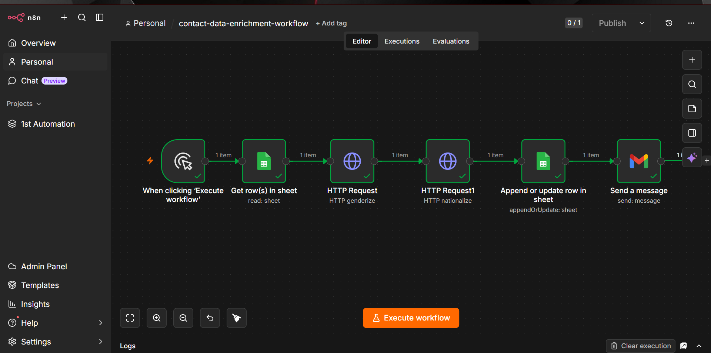

# Contact Data Enrichment Automation

An n8n workflow that reads contact records from Google Sheets, enriches each entry with inferred demographic data via external APIs, writes the enriched results back to the sheet, and sends a confirmation email.

## What It Does

This workflow demonstrates chaining multiple external API calls into a data pipeline:

1. **Read** — Existing contact rows are pulled from Google Sheets.
2. **Enrich** — Each contact's name is passed through two external APIs: Genderize (infers likely gender from name) and Nationalize (infers likely nationality from name).
3. **Write Back** — The enriched data is appended/updated back into the same Google Sheet.
4. **Notify** — A confirmation email is sent once the enrichment run completes.

## Why This Matters

This pattern — read from a data source, enrich via external APIs, write results back, notify on completion — is a reusable structure for any data enrichment task: lead scoring, contact deduplication, third-party data lookups, and similar pipelines. The specific APIs here (Genderize/Nationalize) are illustrative; the same chain works with any REST API.

## Workflow Breakdown

| Stage | Node Type | Function |
|---|---|---|
| Trigger | Manual Trigger | Initiates the workflow run |
| Read | Google Sheets (Get Row(s)) | Pulls existing contact records |
| Enrich | HTTP Request (Genderize API) | Infers gender from name |
| Enrich | HTTP Request (Nationalize API) | Infers nationality from name |
| Write | Google Sheets (Append/Update Row) | Writes enriched data back to the sheet |
| Notify | Email Node | Sends a completion confirmation |

## Tech Stack

- **n8n** — workflow orchestration
- **Google Sheets** — data source and destination
- **Genderize.io / Nationalize.io** — third-party enrichment APIs
- **Email/SMTP node** — completion notification

## Setup

1. Import `contact-data-enrichment-workflow.json` into your n8n instance: **Workflows → Import from File**.
2. Connect your Google Sheets credentials, pointing at the contact sheet you want to enrich.
3. No auth required for Genderize/Nationalize free tier (rate-limited) — for production use, add API keys in the HTTP Request nodes.
4. Connect your email credentials in the notification node.
5. Run manually, or swap the trigger for a Schedule trigger to run enrichment on a recurring basis.

## Roadmap / Next Iteration

- Swap Genderize/Nationalize for a business-relevant enrichment API (e.g., company/contact lookup).
- Add a Schedule trigger to run enrichment automatically on new rows.
- Add an AI node (Claude/OpenAI) to generate a summary or next-action recommendation per enriched contact.

## Screenshot

---

*Part of an ongoing portfolio of n8n automation workflows.*
